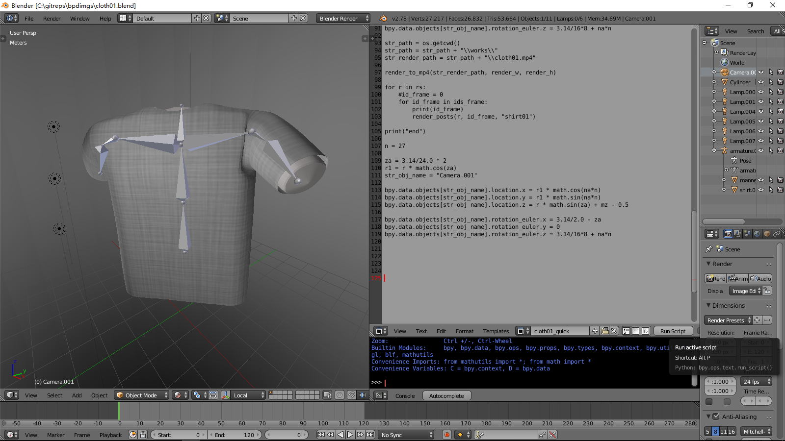
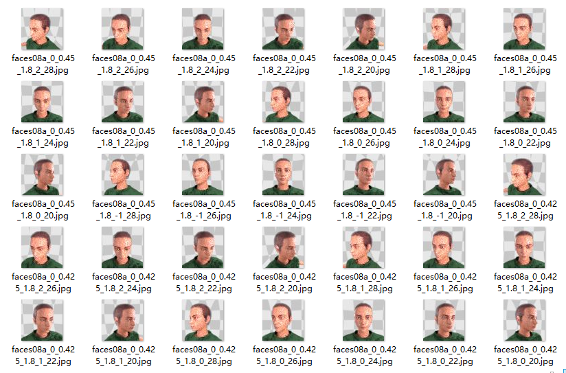

# bpdimgs
  Blender python script generate images for Deep Learning.

  Blender is a open source 3D graphics and animation software: https://www.blender.org/features/

  Python scripts are a powerful and versatile way to extend Blender functionality. 
  Most areas of Blender can be scripted, including Animation, Rendering, Import and Export, 
  Object Creation and the scripting of repetitive tasks: 
  https://docs.blender.org/manual/en/dev/advanced/scripting/introduction.html

  bpdimgs screenshots:

  

  

  win10 gui run blender_cloth01.cmd, click "run script" button render cloth01 blender 3d model to images.

  win10 gui run blender_cloth02.cmd, click "run script" button render cloth02 blender 3d model to images.

  References blender model demo-files: https://www.blender.org/download/demo-files/

  							zhujiangmail@hotmail.com

  								2017.10.09

  
